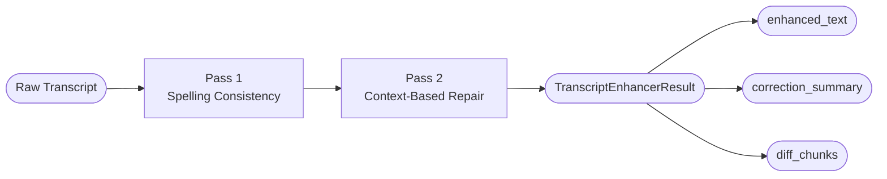

# Automatic Speech Recognition (ASR) Enhancement

This repository demonstrates and evaluates LLM-based post-processing of ASR transcripts using the `TranscriptEnhancer` software component from the [GAIK Toolkit](https://github.com/GAIK-project/gaik-toolkit).

ASR models often produce transcripts that contain spelling errors, inconsistently spelled terms, incorrectly split or merged compound words, and missing or distorted domain-specific vocabulary. The `TranscriptEnhancer` addresses these issues by applying a targeted, two-pass LLM-based correction pipeline to raw ASR output.

The key principle is **targeted fixing**. The enhancement applies the smallest possible corrections to the parts that need fixing, while leaving accurate content completely untouched. The result is a corrected transcript that remains faithful to the original spoken content.

The repository also includes:
- **Transcription scripts** (`transcribers/`) for generating raw ASR transcripts from audio using OpenAI API models (`gpt-4o-transcribe`, `whisper-1`) or a local WhisperX model, if needed as input for the enhancement pipeline.
- **Evaluation scripts** (`eval_enhanced.py`, `side_by_side_compare.py`) for measuring the impact of enhancement against ground truth reference transcripts using WER, CER, spelling error rate, and substitution, deletion, and insertion rates.

> **Language note:** The current two-pass enhancement method is specifically tuned for Finnish. The pipeline structure, API integration, and result format are fully language-agnostic, but the two system prompts (`PASS1_SYSTEM_PROMPT`, `PASS2_SYSTEM_PROMPT`) encode Finnish-specific spelling rules, compound word handling, grammar safety rules, and colloquial form preservation. To adapt the component to a different language, only these two prompts need to be updated. See [How to Adapt to a Different Language](#how-to-adapt-to-a-different-language).

---

## Installation & Setup

### 1. Install dependencies

```bash
pip install -r requirements.txt
```

If you want to run local transcription models for ASR using WhisperX (`transcribers/whisperX.py`), install PyTorch separately following the [official instructions](https://pytorch.org/get-started/locally/), then install WhisperX:

```bash
pip install whisperx
```

### 2. Configure API access

Create a `.env` file in the project root with your API credentials:

```bash
# Azure OpenAI (OPTIONAL. Use  this if you have Azure OpenAI API key)
AZURE_API_KEY=your-azure-api-key

# Standard OpenAI
OPENAI_API_KEY=your-openai-api-key
```

### 3. Run transcript enhancement

```bash
python enhanced_transcript_example.py
```

### 4. Run evaluation

Run this if you want to compare original and enhanced transcripts against reference ground truth:

```bash
python eval_enhanced.py <reference_dir> <hypotheses_root_dir> <enhanced_root_dir>
```

Run this if you want to generate per-file side-by-side alignment reports:

```bash
python side_by_side_compare.py <reference_dir> <hypothesis_dir> <output_dir>
```

---

## How It Works

### Transcript Enhancement

The `TranscriptEnhancer` is a software component of the [GAIK Toolkit](https://github.com/GAIK-project/gaik-toolkit) — a Generative AI Knowledge Management toolkit. The component is part of the `gaik.software_components` package and is documented at [`implementation_layer/src/gaik/software_components/enhance_transcript`](https://github.com/GAIK-project/gaik-toolkit/tree/main/implementation_layer/src/gaik/software_components/enhance_transcript).

The key idea behind the enhancement is targeted fixing rather than regeneration. Instead, the enhancement constrains itself to the smallest possible local corrections, leaving accurate content completely untouched.

### Pipeline Overview



### Initializing the Enhancer

```python
from gaik.software_components.enhance_transcript import (
    TranscriptEnhancer,
    get_openai_config,
)

config = get_openai_config(use_azure=True)
enhancer = TranscriptEnhancer(api_config=config)
```

The constructor accepts three parameters:

| Parameter | Type | Default | Description |
|-----------|------|---------|-------------|
| `api_config` | `dict \| None` | `None` | API config from `get_openai_config()`. Built automatically from environment if omitted. |
| `use_azure` | `bool` | `True` | Selects Azure OpenAI or standard OpenAI when `api_config` is not provided. |
| `model` | `str \| None` | `None` | Optional model override. Defaults to `gpt-5.4` (Azure) or `gpt-5.4-2026-03-05` (OpenAI). |

### Pass 1 — Spelling Consistency

The first LLM call focuses exclusively on spelling correctness and consistency. It does not reason about sentence structure or grammar. Key behaviors:

- Corrects near-miss spelling errors (typically 1–2 character edits)
- Normalizes the same term to one consistent spelling across the entire transcript
- Fixes capitalization of proper nouns and brand names
- **Does not add or remove any words** — word count is strictly preserved

Numbers are explicitly protected and are never reinterpreted or reformatted.

### Pass 2 — Context-Based Repair

The second LLM call receives the Pass 1 output and applies repairs that require sentence-level context. Key behaviors:

- Merges compound words that ASR incorrectly split 
- Splits over-merged tokens when both parts are clearly identifiable
- Inserts short function or filler words from a fixed whitelist when grammar strongly requires it — at most 2 insertions per 100 words
- Preserves spoken/colloquial forms 

### Using the Component

Both `enhance_text()` and `enhance_file()` run the full two-pass pipeline and return a `TranscriptEnhancerResult`.

```python
# Enhance from a string
result = enhancer.enhance_text(
    transcript_text="tama on hammas laakari joka hoitaa peri implantiittia",
    generate_summary=True,   # Include insertion/deletion/substitution counts
    diff_chunks=True,        # Include token-level diff of changes
    additional_instructions="Keep all brand names exactly as written.",  # Pass 2 only
)

# Enhance from a .txt file
result = enhancer.enhance_file(
    file_path="transcripts/Ajokortti.txt",
    generate_summary=True,
    diff_chunks=True,
    encoding="utf-8",        # Default; override if needed
)
```

### Receiving Results

The result is a Pydantic `TranscriptEnhancerResult` and can be serialized directly to JSON:

```python
print(result.enhanced_text)
print(result.correction_summary)
print(result.model_dump_json(indent=2))
```

```json
{
  "original_text": "tama on hammas laakari joka hoitaa peri implantiittia",
  "enhanced_text": "tämä on hammaslääkäri joka hoitaa peri-implantiittia",
  "source_file": "Ajokortti.txt",
  "correction_summary": {
    "total_changes": 3,
    "insertions": 0,
    "deletions": 0,
    "substitutions": 3
  },
  "diff_chunks": [
    { "kind": "substitute", "original": "tama",           "corrected": "tämä" },
    { "kind": "substitute", "original": "hammas laakari", "corrected": "hammaslääkäri" },
    { "kind": "substitute", "original": "peri implantiittia", "corrected": "peri-implantiittia" }
  ]
}
```

`correction_summary` and `diff_chunks` are `null` unless explicitly requested.

---

## How to Adapt to a Different Language

The TranscriptEnhancer software component is currently designed for Finnish. The two-pass pipeline structure, the API integration, and the result format are language-agnostic; however, PASS1_SYSTEM_PROMPT and PASS2_SYSTEM_PROMPT encode Finnish-specific behavior. The spelling rules, the compound word repair logic, the colloquial form preservation list, the function word insertion whitelist, and the grammar safety rules are all tuned for Finnish ASR output.

To adapt to a different language, only the prompts need to change:

- **Pass 1:** Replace Finnish orthography rules and consistency normalization guidance with equivalent rules for the target language. Apply the same approach of identifying the recurring performance issues (errors) in your target language. Update any language-specific examples.
- **Pass 2:** Replace the function word whitelist with the equivalent set for the target language. Update compound word handling rules, colloquial form preservation instructions, and grammar safety rules to reflect how the target language behaves in spoken transcripts.

Both prompt constants are exported from the package and can be used as a starting point:

```python
from gaik.software_components.enhance_transcript import PASS1_SYSTEM_PROMPT, PASS2_SYSTEM_PROMPT
```

---

## Project Structure

```
transcript_eval/
│
├── .env                              # API keys (OPENAI_API_KEY)
├── README.md                         # This file
├── requirements.txt                  # Python dependencies
├── sample.txt                        # Sample transcript for quick testing
├── enhanced_transcript_example.py    # Usage example for the TranscriptEnhancer component
├── eval_enhanced.py                  # Batch evaluation: original vs enhanced, outputs Excel report
├── side_by_side_compare.py          # Per-file word-level alignment reports with error markers
│
└── transcribers/
    ├── transcribe-gpt-4o.py         # Transcribes audio using OpenAI gpt-4o-transcribe
    ├── transcribe-whisper-openai.py  # Transcribes audio using OpenAI whisper-1 API
    └── whisperX.py                   # Transcribes audio using local WhisperX model (GPU)
```

---

## Related Resources

- **GAIK Toolkit:** [github.com/GAIK-project/gaik-toolkit](https://github.com/GAIK-project/gaik-toolkit)
- **TranscriptEnhancer component:** [`enhance_transcript` README](https://github.com/GAIK-project/gaik-toolkit/tree/main/implementation_layer/src/gaik/software_components/enhance_transcript)
- **Example script:** [`enhance_transcript_example.py`](https://github.com/GAIK-project/gaik-toolkit/tree/main/implementation_layer/examples/software_components/enhance_transcript)
- **Project website:** [gaik.ai](https://gaik.ai)
- **Documentation:** [gaik-project.github.io/gaik-toolkit](https://gaik-project.github.io/gaik-toolkit/)
